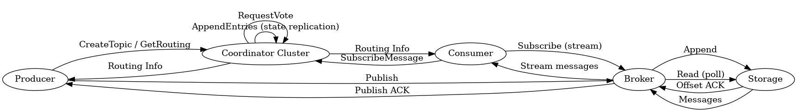

# Mini-Pulsar System Design Document

## 1. System Architecture

Mini-Pulsar is a decoupled, distributed publish-subscribe messaging system inspired by Apache Pulsar. The fundamental design principle is the separation of compute (serving clients) and storage (persisting messages).

The system consists of the following core components:

- **Coordinator Cluster**: The control plane. A cluster of nodes that manages cluster metadata, node registration, health monitoring (heartbeats), and topic partition assignments. 
- **Brokers**: The serving layer. Brokers handle connections from producers and consumers. They contain no persistent message state. Instead, they consult the Coordinator for routing tables, accept messages from producers, and route them to the appropriate Storage Node.
- **Storage Nodes**: The persistence layer. Storage nodes act as a distributed log, storing partition data onto the local filesystem. They do not know about producers or consumers, they only serve `Append` and `Read` RPCs.
- **Producers & Consumers**: Client applications that interact directly with Brokers. Clients initially query the Coordinator cluster to resolve the routing table, discovering which Broker handles which partition for a given topic.

## 2. Custom Log-Based Storage Design

The storage layer is designed as an append-only distributed log, optimizing for fast sequential writes.

- **File Structure**: Each partition of a topic is stored in its own dedicated log file. The directory structure is organized as `<data_dir>/<topic_name>/partition_<id>.log`.
- **Message Format**: Messages are stored as individual lines in the file (JSON Lines format). This ensures that appending a new message is an atomic `O(1)` operation.
- **Payload Encoding**: To support raw binary data without corrupting the newline-delimited JSON structure, message payloads are encoded in Base64 before being written to disk.
- **Offsets**: Offsets are mapped directly to the line number (0-indexed) within the file. Reading from a specific offset simply involves skipping lines up to the target index.
- **Concurrency**: Operations on the same topic-partition use a threading lock to ensure sequential appends, preventing data corruption when multiple brokers write to the same storage node simultaneously.

## 3. gRPC Service Definitions

The communication backbone of Mini-Pulsar is built on gRPC, utilizing Protocol Buffers to strongly type interactions.

### CoordinatorService
Manages the cluster state and metadata operations.
- `Register` / `Heartbeat`: Nodes (Brokers, Storages) use these to join the cluster and prove liveness.
- `CreateTopic`: Initializes a topic by generating partition assignments across the available brokers and storages.
- `SubscribeMessage` / `GetRoutingTable`: Used by clients to resolve broker endpoints for topics.
- `RequestVote` / `AppendEntries`: Internal RPCs used exclusively for the Raft-like consensus algorithm.

### BrokerService
Serves as the gateway for pub/sub traffic.
- `Publish`: Accepts messages from producers, determines the partition hash, and forwards the payload to the mapped StorageNode.
- `AssignPartition`: Used by the Coordinator to push updated routing tables to the broker.
- `Subscribe`: Opens a streaming connection for consumers. The broker actively polls the backend StorageNode and yields batches of messages to the consumer.

### StorageService
Provides low-level block/log storage access.
- `Append`: Writes a serialized payload to the end of a partition file.
- `Read`: Fetches a batch of messages starting from a specific sequential offset.

## 4. The Role of the Consensus Algorithm

In a distributed environment, having a single centralized coordinator introduces a single point of failure and potential split-brain scenarios if network partitions occur. Mini-Pulsar mitigates this using a simplified Raft-like consensus algorithm.

- **State Transitions**: Each Coordinator runs a background `ConsensusNode` that transitions between `FOLLOWER`, `CANDIDATE`, and `LEADER` states. If a follower does not hear a heartbeat within a randomized timeout, it promotes itself to candidate and requests votes.
- **Authoritative Leadership**: To prevent split-brain issues (e.g., two coordinators simultaneously creating a topic with conflicting partition assignments), only the `LEADER` is allowed to execute state-mutating RPCs (`Register`, `CreateTopic`). 
- **Redirects**: If a client sends a write request to a `FOLLOWER`, the node immediately rejects the request with a `UNAVAILABLE` gRPC status and attaches a `NOT_LEADER: <leader_address>` hint. The custom `CoordinatorClient` seamlessly catches this and redirects the request.
- **State Replication**: Cluster metadata (including the active brokers, storage nodes, and partition routing tables) is continuously replicated. The leader packages its current state into a JSON payload attached to the `AppendEntries` heartbeats. Followers parse and apply this JSON, maintaining an eventually consistent local view of the cluster.
- **Persistence**: Upon any state change or vote, nodes persist their current `term`, `voted_for` identity, and the replicated cluster routing data to a local `.json` file. This guarantees that a restarted coordinator node recovers seamlessly into the Raft cluster without losing cluster topology data.

## 5. System Flows

The system clearly separates the control flow (metadata, discovery, clustering) from the data flow (message ingestion and delivery).

### Control Flow (Metadata & Discovery)
1. **Node Registration**: Storage nodes and Brokers start up and invoke `Register` on the Coordinator cluster.
2. **Health Tracking**: Brokers continuously send `Heartbeat` RPCs to the Coordinator. The Coordinator monitors these; if a Broker misses heartbeats, the Coordinator reassigns its partitions to other healthy brokers.
3. **Topic Creation**: A producer asks the Coordinator to `CreateTopic`. The Coordinator (if leader) provisions the topic partitions by deterministically assigning them to registered Brokers and Storage Nodes, then saving and replicating this new state.
4. **Partition Assignment**: The Coordinator actively pushes the new routing map to the designated Brokers via the `AssignPartition` RPC, so Brokers know which Storage Node to talk to.

### Data Flow (Pub/Sub)
1. **Publishing**: 
   - The Producer uses the Coordinator to discover the default Broker.
   - It hashes the message key to compute the partition, then sends a `Publish` RPC to the Broker.
   - The Broker determines the Storage Node for that partition and issues an `Append` RPC.
2. **Consuming**:
   - The Consumer asks the Coordinator for the routing table via `SubscribeMessage` to find which Broker owns which partition.
   - It initiates a `Subscribe` streaming RPC to the Broker(s).
   - The Broker continuously polls the underlying Storage Node using the `Read` RPC, and yields the messages back down the gRPC stream to the Consumer.

## 6. Key Design Choices

1. **Separation of Compute and Storage**: By keeping the Brokers stateless, they can be scaled elastically. If a Broker crashes, the Coordinator instantly detects the missed heartbeat and reassigns the partition to a new Broker without any data movement, because the Storage Node holds the actual data safely on disk.

2. **Coordinator Abstraction (`CoordinatorClient`)**: The complexity of multi-coordinator Raft redirection is hidden from the Nodes and Clients. The `CoordinatorClient` transparently handles retrying and following `NOT_LEADER` hints without cluttering application logic.

3. **JSON Lines Storage**: The simplicity of appending independent JSON objects avoids complex binary parsing. It's incredibly resilient to partial writes and human-readable for debugging, though less storage-efficient than binary packed logs.

4. **Push-Pull Consumer Model**: The Broker pulls from the Storage Node, but pushes (via a gRPC stream) to the Consumer. This reduces latency compared to the Consumer constantly polling the Broker, while keeping the Storage Node implementation simple.

5. **Durable Client Subscriptions**: Client applications (Consumers and Producers) persist their state, such as active topic subscriptions and cached routing metadata, to localized JSON files under a `logs/` directory. If a client is abruptly restarted, it reloads its state from `logs/<id>.json` and automatically resumes its subscriptions, ensuring fault tolerance and uninterrupted message processing.

6. **Partitioned Parallelism**: Topics are divided into multiple partitions distributed across different Brokers and Storage Nodes. This allows Producers to publish messages concurrently (by hashing keys to different partitions) and Consumers to process messages in parallel by spawning dedicated background threads per assigned broker, eliminating single-node bottlenecks.
